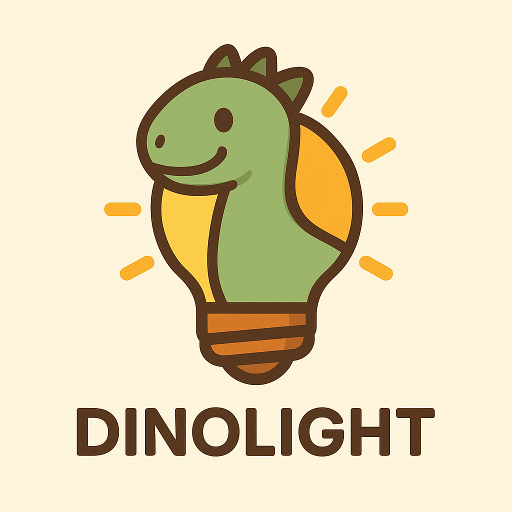
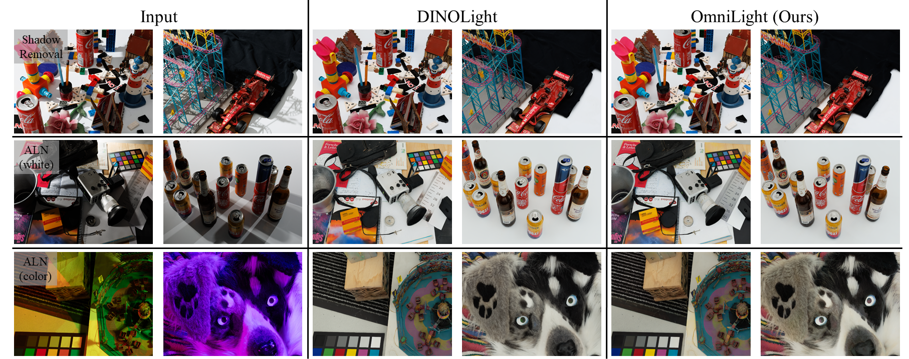

# Lighting-Related-Image-Restoration

<div align="center">
  
  

###### Logo image generated by ChatGPT and Gemini

</div>

<p align="center">
  <a href="https://cvlai.net/ntire/2026/"></a>
  <a href="https://pytorch.org/"></a>
</p>

This repository contains the official implementations of the frameworks **DINOLight** and **OmniLight** developed by the **SNU-ISPL** team for lighting-related image restoration tasks: Image Shadow Removal and Ambient Light Normalization. 

<p align="center"></p>

---

## 📁 Projects Overview

We provide two main frameworks, each exploring contrasting strategies for restoring underlying image content under adverse lighting/illumination conditions. Please navigate to the respective directories for details.

* [**[ICPR2026]🦖DINOLight: Robust Ambient Light Normalization with Self-supervised Visual Prior Integration**](./DINOLight)
  [](https://arxiv.org/abs/2603.12579)
  * A specialized baseline utilizing DINOv2's visual priors for robust ambient light normalization and shadow removal.
* [**[CVPRW2026]💡OmniLight: One Model to Rule All Lighting Conditions**](./OmniLight)
  [](https://arxiv.org/abs/2604.15170)
  * A unified architecture extending DINOLight with WD-MoE, designed to handle diverse lighting conditions as an all-in-one model, demonstrating outstanding generalization capabilities across multiple datasets.

## 🏆 **NTIRE 2026 Challenge Performance** 

We participated in lighting-related image restoration track of the NTIRE 2026 Challenge ([Image Shadow Removal](https://www.codabench.org/competitions/12935/) and Ambient Light Normalization under [White Lighting](https://www.codabench.org/competitions/12703/)/[Color Lighting](https://www.codabench.org/competitions/12792/)), where our methods secured top-tier rankings among numerous participants.

🦖 **DINOLight** 

* 🥇 **[1st] Place** in Fidelity Track: Ambient Light Normalization (Color Lighting)
* 🥈 **[2nd] Place** in Perceptual Track: Ambient Light Normalization (Color Lighting)
* 🥉 **[3rd] Place** in Track: Shadow Removal 

💡 **OmniLight** 

* 🥇 **[1st] Place** in Perceptual Track: Ambient Light Normalization (White Lighting)
* 🥈 **[2nd] Place** in Fidelity Track: Ambient Light Normalization (Color Lighting)
* 🏅 **[4th] Place** in Perceptual Track: Ambient Light Normalization (Color Lighting) 

## 🍀Environment Setup

### 📄 `environment.yml`

List of required packages to reproduce and/or run our method.

- The virtual environment can be set up using the attached `environment.yml`.
- Run the following code and a conda environment named `snuispl` will be created.
```bash
conda env create -f environment.yml
```
- Please note that the provided setup is the one that runs without error on our server; several specific package versions may differ depending on your hardware/software setup.
- We successfully recreated the environment using the `environment.yml` file and confirmed that it works without any issues on our server.
- If any error occurs, we recommend checking `requirements.txt` and manually upgrading/downgrading the necessary packages.
- Our setup/settings are as follows:

```YAML
OS: Ubuntu 22.04.05
GPU: NVIDIA GeForce RTX 3090 24GB
Python: 3.9.21
Cuda: 12.1
PyTorch: 2.1.2+cu121
```

## 📈Dataset
To get started, download WSRD+, Ambient6K, and CL3AN datasets from the official repositories according to their description.

* [WSRD+](https://github.com/fvasluianu97/WSRD-DNSR)
* [Ambient6K](https://github.com/fvasluianu97/IFBlend)
* [CL3AN](https://github.com/fvasluianu97/RLN2)

## 🫶Citation
If you found our work helpful, please consider citing our work.
```
@article{oh2026dinolight,
  title={DINOLight: Robust Ambient Light Normalization with Self-supervised Visual Prior Integration},
  author={Oh, Youngjin and Kwon, Junhyeong and Cho, Nam Ik},
  journal={arXiv preprint arXiv:2603.12579},
  year={2026}
}

@article{oh2026omnilight,
  title={OmniLight: One Model to Rule All Lighting Conditions},
  author={Oh, Youngjin and Park, Junyoung and Kwon, Junhyeong and Cho, Nam Ik},
  journal={arXiv preprint arXiv:2604.15170},
  year={2026}
}
```

## ✉Contact
If you have any questions, please reach us by e-mail (yjymoh0211@snu.ac.kr).

## 🙌Acknowledgements
This project is based on the following projects. We thank the authors for releasing their great work as open-source.
* [NAFNet](https://github.com/megvii-research/NAFNet)
* [Restormer](https://github.com/swz30/Restormer)
* [FFTformer](https://github.com/kkkls/fftformer)
* [DINOv2](https://github.com/facebookresearch/dinov2)
* [MoCE-IR](https://github.com/eduardzamfir/MoCE-IR)
